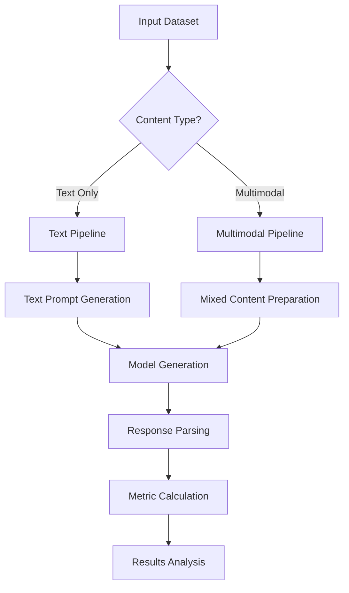

# SciRex: Scientific Research Benchmarking Framework

[](https://img.shields.io/github/v/release/n0w0f/scirex)
[](https://github.com/n0w0f/scirex/actions/workflows/main.yml?query=branch%3Amain)
[](https://img.shields.io/github/commit-activity/m/n0w0f/scirex)
[](https://img.shields.io/github/license/n0w0f/scirex)

Welcome to **SciRex**, a comprehensive Python framework for benchmarking large language models on scientific research tasks. Whether you're working with text-only questions or complex multimodal content involving images and text, SciRex provides the tools you need for rigorous evaluation.

## 🚀 Quick Start

```python
from scirex.task import Dataset
from scirex.model import GeminiModel
from scirex.benchmark import Benchmark
from scirex.prompt import PromptTemplate

# Load your scientific dataset
dataset = Dataset("n0w0f/scirex-image", "particle_energy_2d")

# Initialize model and benchmark
model = GeminiModel("gemini-2.5-flash")
benchmark = Benchmark(model)

# Run evaluation
results = benchmark.run_benchmark(dataset, max_tasks=100)
print(f"Accuracy: {benchmark.compute_summary_metrics(results)['success_rate']:.2%}")
```

## ✨ Key Features

- 🔬 **Scientific Focus**: Designed for scientific research tasks
- 🖼️ **Multimodal Support**:
  - Handle text + image tasks seamlessly
- 🚀 **Easy Integration**:

  - Simple API for custom datasets and models
  - Support for HuggingFace datasets
  - Extensible for custom models and metrics

- 🚀 **Custom Prompt templates**:

  - Allow custom prompt templates
  - Prompt Optimization (Incoming)

- 📊 **Agent for Reward** : (Incoming)
- 🔄 **CoT Faithfulness** : (Incoming)

## 🎯 Use Cases

!!! example "Research Applications"

    **Chemistry Research**

    - Molecular structure recognition and analysis
    - Chemical reaction prediction from diagrams
    - Literature review and knowledge extraction

    **Materials Science**

    - Crystal structure identification
    - Microstructure analysis from SEM/TEM images
    - Property prediction from structural data

    **Biology**

    - Cell morphology classification
    - Protein structure analysis
    - Medical image interpretation

## 📚 What's in the Documentation

### For Beginners

- **[Installation Guide](getting-started/installation.md)**: Set up SciRex with uv, pip, or conda
- **[Quick Start](getting-started/quickstart.md)**: Run your first benchmark in 5 minutes
- **[First Benchmark](getting-started/first-benchmark.md)**: Step-by-step tutorial

### For Practitioners

- **[Text Benchmarks](guides/text-benchmark.md)**: Traditional Q&A evaluation
- **[Multimodal Benchmarks](guides/multimodal-benchmark.md)**: Image + text tasks

### For Developers

- **[API Reference](api-reference/task.md)**: Complete class and method documentation

## 🔧 Installation

=== "uv (Recommended)"

    ```bash
    # Install uv
    curl -LsSf https://astral.sh/uv/install.sh | sh

    # Add SciRex to your project
    uv add git+https://github.com/n0w0f/scirex.git
    uv add python-dotenv google-genai datasets pillow
    ```

=== "pip"

    ```bash
    pip install git+https://github.com/n0w0f/scirex.git
    pip install python-dotenv google-genai datasets pillow
    ```

=== "conda"

    ```bash
    conda install pip
    pip install git+https://github.com/n0w0f/scirex.git
    conda install python-dotenv pillow
    pip install google-genai datasets
    ```

## 🎬 Example Gallery

### Text-Only Benchmark

```python
from scirex.task import Dataset
from scirex.model import GeminiModel
from scirex.benchmark import Benchmark
from scirex.prompt import PromptTemplate

# Chemistry Q&A evaluation
dataset = Dataset("n0w0f/scirex-text", "particel_energy_2d")
model = GeminiModel("gemini-2.5-flash")
benchmark = Benchmark(model)

results = benchmark.run_benchmark(dataset)
summary = benchmark.compute_summary_metrics(results)
print(f"Chemistry Q&A Accuracy: {summary['success_rate']:.2%}")
```

### Multimodal Benchmark

```python
# Materials science with images
dataset = Dataset("jablonkagroup/MacBench", "isomers")
model = GeminiModel("gemini-2.5-flash")  # Vision-enabled model
benchmark = Benchmark(model, test_multimodal=True)

results = benchmark.run_benchmark(dataset)

```

### Custom Evaluation

```python
from scirex.task import Task

# Create custom molecular analysis task
task = Task(
    uuid="mol-001",
    name="Benzene Ring Count",
    description="Count benzene rings in molecular structure",
    answer_type="numeric",
    target=2.0,
    keywords=["chemistry", "organic"],
    is_multimodal=True,
    input_template="In {type1} {entry1}, how many benzene rings are present?",
    qentries_modality={
        "structure": {
            "type1": {"type": "text", "value": "this molecular structure"},
            "entry1": {"type": "image", "value": "data:image/png;base64,..."}
        }
    }
)

result = benchmark.run_single_task(task)
print(f"Predicted: {result.parsed_answer} rings, Actual: {task.target} rings")
```

## 📈 Performance Insights



## 🤝 Community

- **GitHub**: [Issues](https://github.com/n0w0f/scirex/issues) and [Discussions](https://github.com/n0w0f/scirex/discussions)
- **Examples**: Community-contributed benchmarks and datasets
- **Contributing**: See our [Contributing Guide](https://github.com/n0w0f/scirex/blob/main/CONTRIBUTING.md)

## 📄 Citation

If you use SciRex in your research, please cite:

```bibtex
@software{scirex2024,
  title={SciRex: Scientific Research Benchmarking Framework},
  author={Nawaf Alampara, Paige Bailey},
  year={2024},
  url={https://github.com/n0w0f/scirex},
  version={1.0.0}
}
```

---

Ready to get started? Head to the **[Installation Guide](getting-started/installation.md)** or jump into the **[Quick Start](getting-started/quickstart.md)**!
